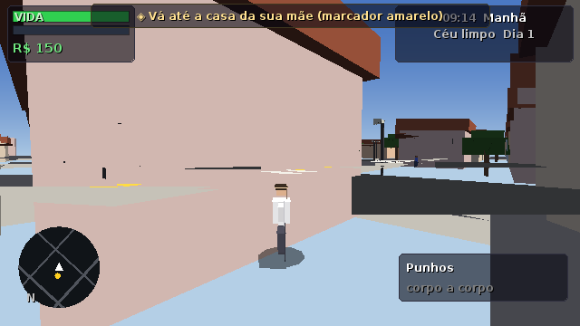
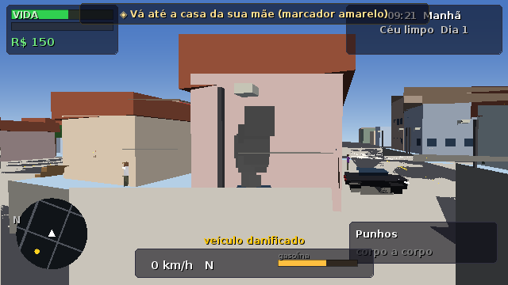
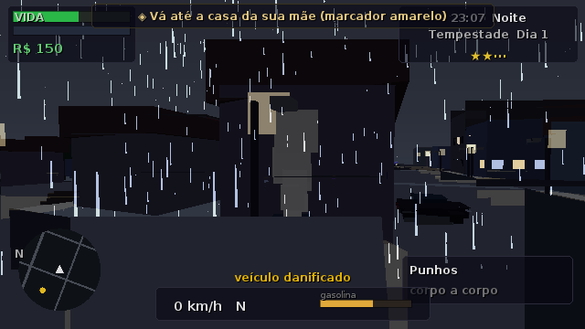

# PORTO AURORA — jogo 3D de mundo aberto em Java puro

Jogo de ação urbana inspirado na estrutura e escala dos grandes jogos de mundo aberto,
implementado **100% em Java, sem nenhuma dependência externa**: engine própria
(game loop, cenas, física, streaming), **renderizador 3D por software** (rasterização
com z-buffer, iluminação, neblina, sombras, partículas), **áudio 100% sintetizado**
(motor, armas, sirenes, chuva e rádio com 4 estações de música procedural).

## Como executar

Requisito: **JDK 17+** (testado com Temurin 17).

```bash
# Linux/macOS
./run.sh

# Windows
run.bat
```

Ou com Maven (também sem dependências):

```bash
mvn -q compile exec:java
```

Modos auxiliares:

```bash
java -cp gamebuild ohkt.Main --selftest   # bateria de testes automatizados
java -cp gamebuild ohkt.Main --shot pasta 42  # 42s de jogo simulado + screenshots
```





## A cidade

Porto Aurora tem **676 quadras** (~1,1 km²) com 8 bairros — Centro Financeiro,
Zona Comercial, Jardim das Acácias, Vila do Metal, Cais do Porto, Parque Aurora,
Periferia e Zona Mista — além de praia, mar navegável, calçadão e a **Ilha do Farol**.
Tudo é gerado deterministicamente por seed e transmitido por **streaming de chunks**
(sem telas de carga).

## Sistemas implementados

| Sistema | Destaques |
| --- | --- |
| Engine | loop com passo fixo 60Hz, gerenciador de cenas, event bus, pooling |
| Render | rasterizador software, frustum culling, LOD, névoa, dia/noite, chuva |
| Player | andar/correr/pular/agachar/nadar, mira, respawn, morte, prisão |
| Veículos | 9 modelos fictícios, aceleração/freio/direção/derrapagem, marchas, combustível, dano, explosão, luzes, buzina, rádio |
| NPCs | pedestres com rotinas por horário, conversas, pânico, denúncias, motoristas com semáforos, criminosos noturnos |
| Polícia | 5 estrelas de procurado, viaturas, policiais a pé, bloqueios, helicóptero com holofote, prisão |
| Combate | 7 armas fictícias (GP-9, Tufão .44, Vespa K, Bruta-12, Condor AR…), headshot, recuo, recarga, tracer, explosões |
| Missões | campanha de 10 missões com cutscenes/diálogos + táxi, corridas, entregas, recompensas, caçada e eventos aleatórios |
| Economia | dinheiro persistente, 8 tipos de loja, concessionária, oficina (pintura/motor/pneus), 3 propriedades com renda |
| Interiores | lojas, hospital, delegacia e casas seguras entram sem tela de carga |
| Mundo | ciclo dia/noite com janelas acesas e postes, clima (chuva/tempestade/neblina) que afeta aderência e visibilidade |
| Save | 3 slots + autosave (posição, armas, veículos, missões, propriedades, stats) |
| Rede | servidor HTTP local opcional com estatísticas ao vivo (`/status`) |
| Entrada | teclado + mouse com teclas configuráveis + gamepad Linux (`/dev/input/js*`) |

## Controles (padrão)

| Ação | Tecla |
| --- | --- |
| Mover | `W A S D` |
| Correr / Pular / Agachar | `Shift` / `Espaço` / `Ctrl` |
| Interagir / Entrar-sair veículo | `E` / `F` |
| Atirar / Mirar | `Mouse Esq.` / `Mouse Dir.` |
| Recarregar / Trocar arma | `R` / `Scroll` ou `1-7` |
| Freio de mão | `Espaço` (no veículo) |
| Buzina / Faróis / Rádio | `H` / `L` / `B` |
| Câmera 1ª/3ª pessoa | `C` |
| Mapa grande | `M` |
| Pausa | `Esc` |
| Debug | `F3` |

Gamepad: analógico esquerdo move, direito controla câmera, `RT` atira,
`A` interage, `Y` entra/sai, `B` buzina, `X` recarrega, `Start` pausa.

## Arquitetura

```
src/main/java/ohkt/
├── Main.java            ponto de entrada (--selftest/--shot/--play)
├── engine/     loop, cenas, janela, input (teclado/mouse/gamepad), settings, eventos
├── graphics/   renderer 3D software, meshes, câmera, frustum, partículas
├── physics/    colisores estáticos em spatial-hash, raycast, resolução de círculo
├── world/      cidade determinística, chunks/streaming, ruas/semaforos, tempo, clima, interiores
├── player/     personagem, câmeras, roupas
├── vehicle/    catálogo, física de veículos, pool/estacionamento
├── npc/        pedestres/motoristas/criminosos com IA de estados e rotinas
├── police/     procurado, dispatcher, perseguição, bloqueios, helicóptero
├── combat/     armas, balística raycast, melee, explosões, pickups
├── mission/    campanha, objetivos, cutscenes, atividades, eventos aleatórios
├── economy/    dinheiro, lojas, propriedades
├── audio/      mixer 3D, síntese de efeitos, rádio procedural
├── ui/         HUD (minimapa, wanted, velocímetro) e menus completos
├── save/       slots de save reais em disco + estatísticas
├── network/    servidor HTTP local de estatísticas
└── tools/      selftest e smoke script (validação contínua)
```

## História

Dante Moraes volta a Porto Aurora depois de 6 anos e descobre que a mãe
deixou uma dívida com Dona Lurdes — e que o Inspetor Braga vende a cidade
pedaço por pedaço para os Corvos do Cais. 10 missões conduzem a história
até o farol.

---
Projeto entregue como código executável: 69 arquivos-fonte (~12,5 mil linhas),
`--selftest` com 33 verificações e smoke test headless de 42s com screenshots
(compilação validada com JDK 17/25; rode `./run.sh`).

Para CI no GitHub Actions, copie `ci/ci.yml` para `.github/workflows/`.
